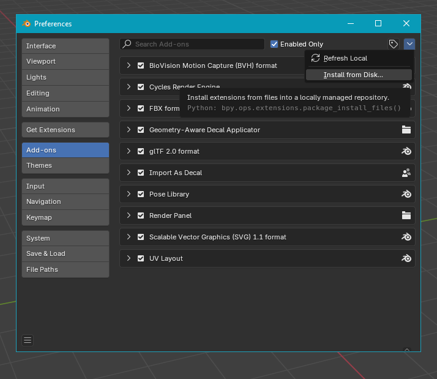
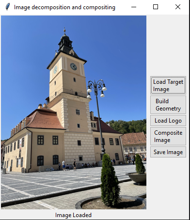
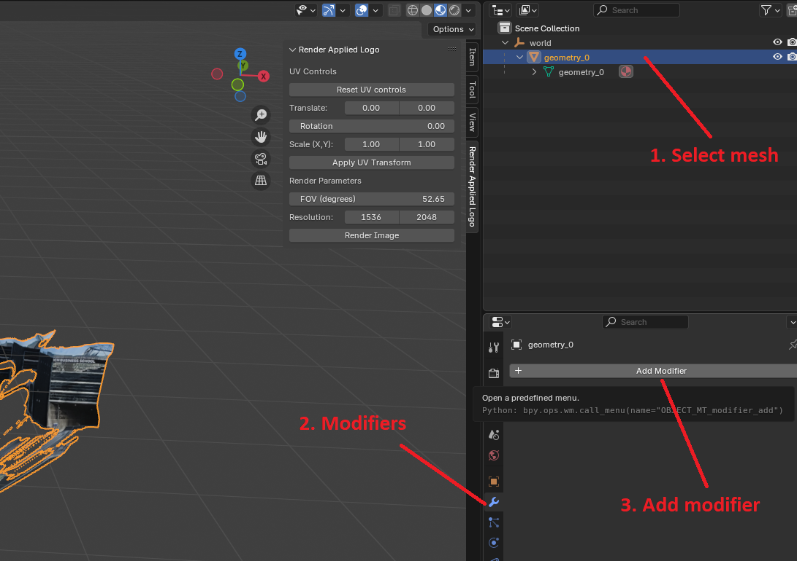
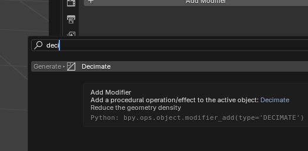
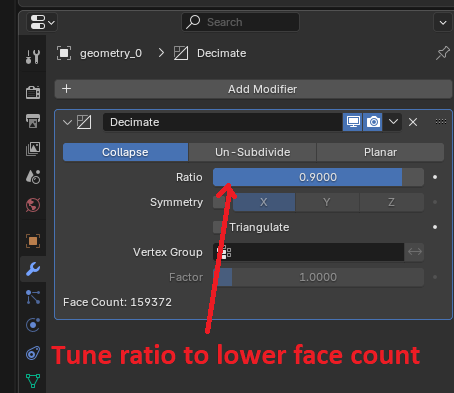
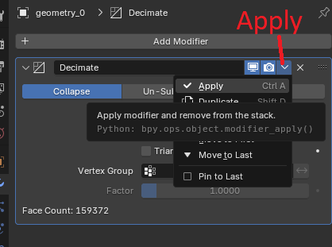
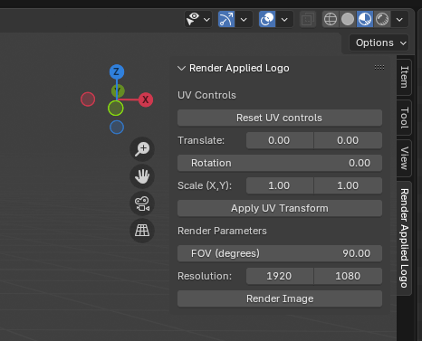

# Natural Logo Insertion
Insert images onto a target such that it properly conforms to the geometry and respects the scene illumination. This does NOT use projection!

## Building Geometry and Compositing
The composite.py script can be used to convert the image to a mesh to then be used in the Blender Add-on and to composite the result of the Blender Add-on in a way that takes into consideration lighting.

## Setup
After cloning the repo you will still need to install MoGe (https://github.com/microsoft/MoGe), and Intrinsic Image Decomposition (https://github.com/compphoto/Intrinsic) as packages.

MoGe can be installed as follows:
```
git clone https://github.com/microsoft/MoGe.git
cd MoGe
pip install -r requirements.txt
pip install .
```
Intrinsic Image Decomposition can be installed as follows:
```
git clone https://github.com/compphoto/Intrinsic
cd Intrinsic
pip install .
```

For more details you can visit the GitHub pages of the two projects linked above

## Blender Add-on Installation Instructions
Open Blender and navigate to Edit > Preferences. Go to Add-ons and click on the downward arrow on the top-right to access the drop-down menu for "Install from disk...". Locate the cloned Python scripts GeomDecalApplicator.py and RenderPanel.py to install.



## How to Use
The script can be run by using the following command:
```python composite.py```.
The script will then require 5 to 10 seconds to load the MoGe and Intrinsic Image Decomposition models before the GUI appears

### Building Geometry
First use 'Load Target' to select the image, on success a preview of the image will appear on screen. Then use 'Build Geometry' to build the mesh. Once finished you will be prompted to select a folder in which to save the mesh. The camera FOV will also be displayed which will be needed for rendering in the Blender Add-on. You can then use this mesh in the Blender Add-on. 



Note that depending on hardware specs, the mesh may need to be first decimated to reduce computation time. Our machines showed good performance at a max of ~200,000 faces.









### Applying Target Image
Once your scene geometry from MoGE is loaded into Blender, simply press F8 to execute the add-on. 
First load your PNG logo image. Once loaded, the 3D cursor is brought up to indicate where on the geometry you would like to apply the logo. You are free to move the 3D Viewport around to direct the target region. You can then use the mousewheel to expand or shrink the selection region.
Once the desired target region is selected, press Enter to apply the logo image as a texture. 

### Tuning Image Placement
To fine-tune the UV parameters, bring up the Render Panel by navigating to the side toolbar (next to the Navigation Gizmo). This may be collapsed by default (in which case it is a leftward arrow); click on it to expand. The click on Render Applied Logo to bring up the panel. Logo translation, rotation, scale can be adjusted here. 



### Rendering Target Image
After entering resolution information (of the original target image) and FOV (estimated by MoGe), export the result to a PNG by clicking on Render Image. This will saved in the same directory as where the Blender scene file is located, so be sure to save your scene beforehand.

## Compositing
After running the Blender Add-on you can use the 'Composite Image' option to insert the result into the image. First use 'Load Target' to select the image that will have the logo inserted into it. Then use 'Load Logo' to select the result of the Blender Add-on, the logo should have the same resolution as the target image. After each of the steps you should see a confirmation message at the bottom of the GUI. Use 'Composite Image' to generate the final image. On success a preview of the result will appear on screen and the image can be saved using 'Save Image'
